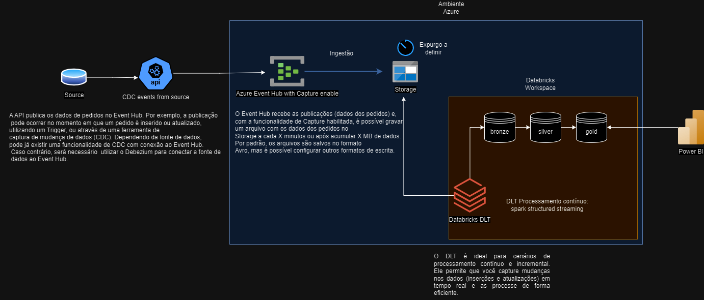

# databricks-streaming
draw.io: https://drive.google.com/file/d/1xQAKWxL4OZRzpa9AY5poGXJZJGTIm5d3/view?usp=sharing

dataframe usado no notebook como exemplo:
https://www.kaggle.com/datasets/gabrielramos87/an-online-shop-business

Considerando que o squad de produtos ainda não tem uma solução para transacionar os dados de pedidos para dentro do lake, segue uma sugestão:

Solução para streaming databricks:

# Arquitetura de Processamento de Dados de Pedidos

## Visão Geral da Solução

A arquitetura descrita é projetada para capturar, processar e armazenar dados de pedidos de forma eficiente, permitindo análise em tempo real e integração com ferramentas de visualização como o Power BI.

## 1. Captura de Dados (Ingestão)

- **Fonte de Dados (Source)**: A solução inicia com uma fonte de dados onde os pedidos são gerados. Estes dados são capturados usando eventos de CDC (Change Data Capture) para detectar mudanças, como inserções ou atualizações de pedidos.
- **CDC**: Uma API é utilizada para publicar os eventos de dados de pedidos diretamente no Azure Event Hub em um **tópico específico**, permitindo que mudanças nos dados sejam rapidamente transmitidas para o sistema de processamento. A publicação no Event Hub pode ocorrer automaticamente quando um pedido é inserido ou atualizado, utilizando triggers de banco de dados ou uma ferramenta de CDC. Caso a fonte de dados tenha suporte nativo para CDC, ele pode ser usado diretamente; caso contrário, uma ferramenta como o Debezium pode ser integrada para capturar essas mudanças.

## 2. Processamento de Dados (Event Hub e Storage)

- **Azure Event Hub**: O Event Hub recebe os eventos de pedidos publicados pela API, atuando como um ponto de entrada escalável para ingestão de dados, capaz de lidar com grandes volumes de eventos em tempo real.
- **Capture Habilitado**: Com a funcionalidade de Capture habilitada, o Event Hub armazena os dados recebidos em intervalos de tempo definidos ou após acumular um determinado volume de dados. Esses dados são escritos em um serviço de armazenamento (Storage), facilitando a persistência e reprocessamento. Os dados são armazenados em um Azure Blob Storage ou Data Lake, em formato Avro por padrão, mas pode ser configurado para outros formatos como Parquet ou JSON, conforme necessário para processamento e análise.

## 3. Processamento e Transformação (Databricks Workspace)

- **Databricks DLT (Delta Live Tables)**: No Databricks, o Delta Live Tables é utilizado para o processamento contínuo dos dados armazenados. O DLT usa Spark Structured Streaming para processar dados de forma incremental e em tempo real, seguindo o padrão de camadas de bronze, prata e ouro:
  - **Camada Bronze**: Armazena os dados brutos ingeridos do Event Hub, no formato original.
  - **Camada Prata**: Limpa e transforma os dados para remover duplicatas, lidar com valores nulos, e aplicar regras de qualidade de dados.
  - **Camada Ouro**: Dados refinados e prontos para consumo analítico, incluindo agregações, cálculos de métricas, e dados prontos para relatórios.

## 4. Visualização e Análise (Power BI)

- **Power BI**: A camada de ouro é conectada ao Power BI para visualização e análise de dados. O Power BI consome os dados preparados para criar dashboards, relatórios, e fornecer insights sobre os pedidos.

## Alternativa ao DLT (Event-Driven):

1. **Event-Driven ao invés de DLT**: 
Alternativa ao uso de Delta Live Tables (DLT) é utilizar um modelo Event-Driven, ou seja, a execução de um job é acionada por um evento, como o trigger de um arquivo, no momento em que o Capture do Event Hub grava o arquivo no storage. Essa abordagem pode ser mais econômica se a quantidade de dados gravados em tempo real não for muito grande. Isso ocorre porque a abordagem com DLT usa o tipo de processamento "Continuous", o que significa que o job fica executando continuamente, monitorando e processando os dados à medida que eles chegam. Embora isso garanta uma latência muito baixa e dados sempre atualizados, pode resultar em um uso constante de recursos, mesmo quando o volume de dados é baixo.

Com o modelo de streaming Event-Driven, o job só executa quando o Capture grava o arquivo no storage, de acordo com as condições estabelecidas: por exemplo, quando o tópico do Event Hub atinge um tamanho específico em megabytes (MB) ou após um intervalo de tempo definido. Essa abordagem pode ser configurada para que o job execute apenas quando necessário, evitando execução desnecessária e, portanto, reduzindo custos. Por exemplo, se definirmos no Event Hub um limiar de 100 MB para gravações, podemos ter um cenário onde esse limite é atingido a cada 5 minutos. Isso faz com que o job só seja acionado nesse momento, processando um lote de dados ao invés de processar continuamente.

No entanto, é importante considerar o comportamento dos dados. Se o volume de dados for alto e houver uma frequência constante de inserções e atualizações, como no cenário atual, a latência introduzida ao esperar por 100 MB ou um intervalo de tempo pode não ser aceitável, especialmente se dados atualizados em tempo real forem críticos para o negócio.

Considerando que, no cenário atual, teremos uma frequência constante de inserções e atualizações de pedidos, optei por utilizar Delta Live Tables (DLT). Esta escolha se deve ao fato de que DLT é mais adequado para processamento contínuo e em tempo real, garantindo que as mudanças sejam refletidas quase instantaneamente nos dados processados. Além disso, DLT oferece vantagens adicionais, como a automação de gerenciamento de dependências, integridade dos dados através de transações ACID, e um sistema de monitoramento integrado, que simplifica a manutenção e garante um fluxo de dados resiliente e eficiente. Com DLT, podemos assegurar que a análise de dados e a tomada de decisões possam ser feitas com base nas informações mais recentes, sem atrasos significativos, o que é essencial para manter a competitividade e a eficiência operacional. o DLT.

